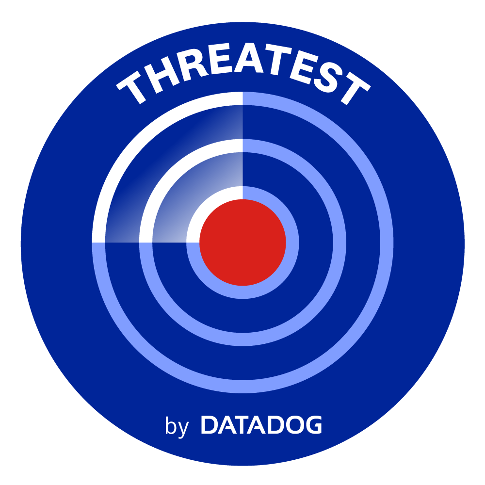

# Threatest


<p align="center">
  
</p>

Threatest is a CLI and Go framework for testing threat detection end-to-end.

Threatest allows you to **detonate** an attack technique, and verify that the alert you expect was generated in your favorite security platform.

Read the announcement blog post: https://securitylabs.datadoghq.com/articles/threatest-end-to-end-testing-threat-detection/

## Concepts

### Detonators

A **detonator** describes how and where an attack technique is executed.

Supported detonators:
* Local command execution
* SSH command execution
* Stratus Red Team
* AWS detonator

### Alert matchers

An **alert matcher** is a platform-specific integration that can check if an expected alert was triggered.

Supported alert matchers:
* Datadog security signals

### Detonation and alert correlation

Each detonation is assigned a UUID. This UUID is reflected in the detonation and used to ensure that the matched alert corresponds exactly to this detonation.

The way this is done depends on the detonator; for instance, Stratus Red Team and the AWS Detonator inject it in the user-agent; the SSH detonator uses a parent process containing the UUID.

## Usage

### Through the CLI

Threatest comes with a CLI that you can use to run test scenarios described as YAML, following a specific [schema](./schemas/threatest.schema.json). You can configure this schema in your editor to benefit from in-IDE linting and autocompletion (see [documentation for VSCode](https://marketplace.visualstudio.com/items?itemName=redhat.vscode-yaml#associating-a-schema-to-a-glob-pattern-via-yaml.schemas) using the [YAML](https://marketplace.visualstudio.com/items?itemName=redhat.vscode-yaml) extension).

Install the CLI by downloading a [binary release](https://github.com/DataDog/threatest/releases) or with Homebrew:

```
brew tap datadog/threatest https://github.com/datadog/threatest
brew install datadog/threatest/threatest
```

Sample usage:

```bash
$ threatest lint scenarios.threatest.yaml
All 6 scenarios are syntaxically valid

# Local detonation
$ threatest run local-scenarios.threatest.yaml

# Remote detonation over SSH
$ threatest run scenarios.threatest.yaml --ssh-host test-box --ssh-username vagrant

# Alternatively, specify SSH parameters from environment variables
$ export THREATEST_SSH_HOST=test-box
$ export THREATEST_SSH_USERNAME=vagrant
$ threatest run scenarios.threatest.yaml
```

Sample scenario definition file:

```yaml
scenarios:
  # Example 1: Remote detonation over SSH
  # Note: SSH configuration is provided using the --ssh-host, --ssh-username and --ssh-keyfile CLI arguments
  - name: curl metadata service
    detonate:
      remoteDetonator:
        commands: ["curl http://169.254.169.254 --connect-timeout 1"]
    expectations:
      - timeout: 1m
        datadogSecuritySignal:
          name: "Network utility accessed cloud metadata service"
          severity: medium

  # Example 2: Stratus Red Team detonation
  # Note: You must be authenticated to the relevant cloud provider before running it
  # The example below is equivalent to manually running "stratus detonate aws.exfiltration.ec2-security-group-open-port-22-ingress"
  - name: opening a security group to the Internet
    detonate:
      stratusRedTeamDetonator:
        attackTechnique: aws.exfiltration.ec2-security-group-open-port-22-ingress
    expectations:
      - timeout: 15m
        datadogSecuritySignal:
          name: "Potential administrative port open to the world via AWS security group"
```


You can output the test results to a JSON file:

```
$ threatest run scenarios.threatest.yaml --output test-results.json
$ cat test-results.json
[
  {
    "description": "change user password",
    "isSuccess": true,
    "errorMessage": "",
    "durationSeconds": 22.046627348,
    "timeDetonated": "2022-11-15T22:26:14.182844+01:00"
  },
  {
    "description": "adding an SSH key",
    "isSuccess": true,
    "errorMessage": "",
    "durationSeconds": 23.604699625,
    "timeDetonated": "2022-11-15T22:26:14.182832+01:00"
  },
  {
    "description": "change user password",
    "isSuccess": false,
    "errorMessage": "At least one scenario failed:\n\nchange user password returned: change user password: 1 assertions did not pass\n =\u003e Did not find Datadog security signal 'bar'\n",
    "durationSeconds": 3.505294235,
    "timeDetonated": "2022-11-15T22:26:36.229349+01:00"
  }
]
```

By default, scenarios are run with a maximum parallelism of 5. You can increase this setting using the `--parallelism` argument.
Note that when using remote SSH detonators, each scenario running establishes a new SSH connection.

### Using Threatest programmatically

See [examples](./examples) for complete programmatic usage example.

#### Testing Datadog Cloud SIEM signals triggered by Stratus Red Team

```go
threatest := Threatest()

threatest.Scenario("AWS console login").
  WhenDetonating(StratusRedTeamTechnique("aws.initial-access.console-login-without-mfa")).
  Expect(DatadogSecuritySignal("AWS Console login without MFA").WithSeverity("medium")).
  WithTimeout(15 * time.Minute)

assert.NoError(t, threatest.Run())
```

### Testing Datadog Cloud Workload Security signals triggered by running commands over SSH

```go
ssh, _ := NewSSHCommandExecutor("test-box", "", "")

threatest := Threatest()

threatest.Scenario("curl to metadata service").
  WhenDetonating(NewCommandDetonator(ssh, "curl http://169.254.169.254 --connect-timeout 1")).
  Expect(DatadogSecuritySignal("EC2 Instance Metadata Service Accessed via Network Utility"))

assert.NoError(t, threatest.Run())
```
